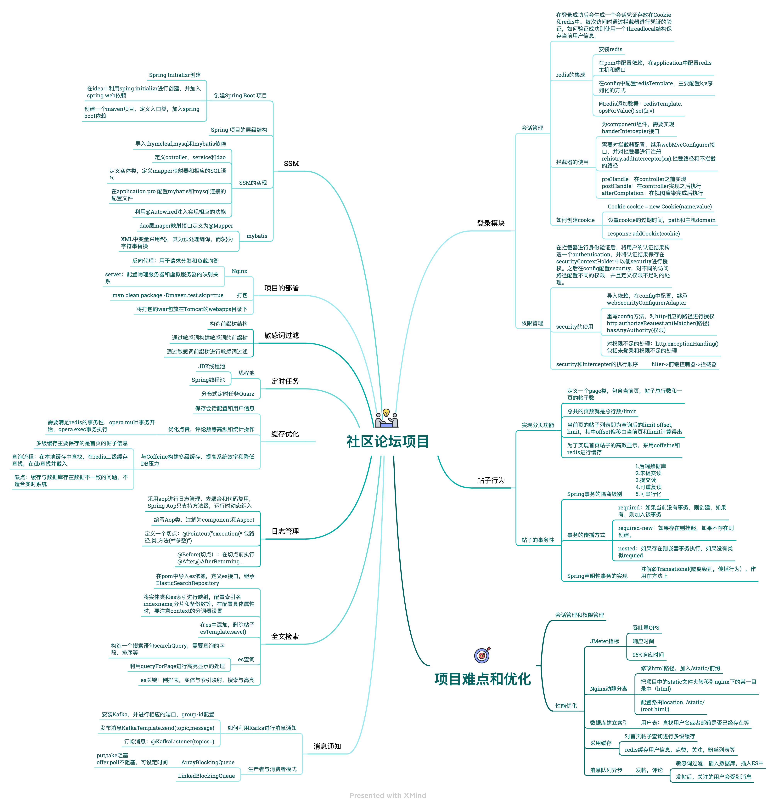

# 论坛社区开发

#### 项目介绍
基于Spring Boot框架实现讨论社区的功能，
包括社区登录、发布评论帖子、消息通知和社区搜索等功能。
项目后续利用jenkins建立流水线实现持续集成，并利用自动化测试框架对项目进行测试。

#### 项目整体架构
* community项目源码： [community](./src)  
* pytest框架自动化测试源码： [pytest](./pytest)  
* jenkins持续集成的实现：[jenkins](./jenkins)  

#### 环境搭建
* 安装mysql5.7  
1、	下载 MySQL yum包
`wget http://repo.mysql.com/mysql57-community-release-el7-10.noarch.rpm`  
2、	安装MySQL源
`rpm -Uvh mysql57-community-release-el7-10.noarch.rpm`  
3、	安装MySQL服务端,需要等待一些时间：
`yum install -y mysql-community-server`  
4、启动MySQL：
`systemctl start mysqld.service`  
5、检查是否启动成功：
`systemctl status mysqld.service`  
6、获取临时密码，MySQL5.7为root用户随机生成了一个密码：
`grep 'temporary password' /var/log/mysqld.log`  
7、登录进MySQL后重设密码：
`set password for root@localhost = password('Mysql66!');`  
8、授权其他机器远程登录：
`GRANT ALL PRIVILEGES ON *.* TO 'root'@'%' IDENTIFIED BY 'Mysql66!' WITH GRANT OPTION;
FLUSH PRIVILEGES;`  
9、开启开机自启动,先退出mysql命令行，然后输入以下命令：
`systemctl enable mysqld
systemctl daemon-reload`  
10、设置MySQL的字符集为UTF-8，令其支持中文：
`vim /etc/my.cnf`
`
[mysql]
default-character-set=utf8
[mysqld]
datadir=/var/lib/mysql
socket=/var/lib/mysql/mysql.sock
default-storage-engine=INNODB
character_set_server=utf8
symbolic-links=0
log-error=/var/log/mysqld.log
pid-file=/var/run/mysqld/mysqld.pid
`  
11、重启一下MySQL,令配置生效：
`service mysqld restart`  
12、防火墙开放3306端口：
`firewall-cmd --state
firewall-cmd --zone=public --add-port=3306/tcp --permanent
firewall-cmd –reload`   
13、加载MySQL数据： 在MySQL中新建一个database，并执行SQL脚本  
`create database community;  
source sql/init_schema.sql
source sql/init_data.sql
source sql/tables_mysql_innodb.sql` 

* 安装JDK  
通过yum命令安装jdk，不需要配置环境变量就能进行使用,前提需要网络通畅 ，查看云端目前支持安装的jdk版本：
`yum -y list java*`  
安装jdk11:
`yum install java-11-openjdk.x86_64`  
安装完成后，测试是否安装成功:
`java –version`  
搜索java文件，查找jdk安装目录:
`find / -name java`  
或`ll /etc/alternatives/` 找到java的软连接。  
在/ect/profile中配置环境：  
`export JAVA_HOME=/usr/lib/jvm/java-11-openjdk-11.0.15.0.9-2.el7_9.x86_64/
export CLASSPATH=.:$JAVA_HOME/lib
export PATH=$PATH:$JAVA_HOME/bin`  

* 安装maven  
下载maven:
`wget https://dlcdn.apache.org/maven/maven-3/3.8.5/binaries/apache-maven-3.8.5-bin.tar.gz --no-check-certificate`  
解压缩：
`tar -zxvf apache-maven-3.8.5-bin.tar.gz -C /usr/local/`  
在/etc/profile中配置环境变量：
`export MAVEN_HOME=/usr/local/apache-maven-3.8.5
export PATH=$PATH:$MAVEN_HOME/bin`
在settings.xml配置aliyun镜像源：  
`<mirror>
<id>aliyunmaven</id>
<mirrorOf>*</mirrorOf>
<name>阿里云公共仓库</name>
<url>https://maven.aliyun.com/repository/public</url>
</mirror>`  

* 安装redis  
下载redis：`wget https://download.redis.io/releases/redis-5.0.14.tar.gz`  
解压：`tar -zxvf redis-5.0.14.tar.gz`  
进入redis-5.0.14执行编译并指定安装目录: `make install PREFIX=/usr/local/redis5.0`  
将解压目录下的redis.conf复制到redis安装目录：
`cp redis.conf /usr/local/redis5.0/`
修改 `redis.conf` 文件，把 `daemonize no` 改为 `daemonize yes`  
进入bin目录启动redis: `./redis-server ../redis.conf`  
在/ect/profile中配置redis环境变量：  
`export REDIS_HOME=/usr/local/redis5.0
export PATH=$PATH:$REDIS_HOME/bin`  
使profile文件生效：`source /ect/profile`  
测试redis：`redis-cli`  

* 安装Tomcat  
下载：`wget https://dlcdn.apache.org/tomcat/tomcat-9/v9.0.62/bin/apache-tomcat-9.0.62.tar.gz --no-check-certificate`
在`vim /etc/profile`中配置环境变量：  
`export TOMCAT_HOME=/usr/local/apache-tomcat-9.0.62
export PATH=$PATH:$TOMCAT_HOME/bin`  
在tomcat/bin目录下启动tomcat：`./startup.sh`
配置安全组策略，开放8080端口，在浏览器输入：
`122.112.139.207:8080`测试  

* 安装Kafka  
下载：`wget https://archive.apache.org/dist/kafka/2.3.0/kafka_2.12-2.3.0.tgz`  
解压：`tar -zxvf kafka_2.12-2.3.0.tgz -C /usr/local/`  
启动zookeper:
`bin/zookeeper-server-start.sh -daemon config/zookeeper.properties`  
后台启动kafka:
`nohup bin/kafka-server-start.sh config/server.properties 1>/dev/null 2>&1 &`  

* 安装es  
下载es：`wget https://artifacts.elastic.co/downloads/elasticsearch/elasticsearch-6.4.3.tar.gz`  
下载分词器：
`wget https://github.com/medcl/elasticsearch-analysis-ik/releases/download/v6.4.3/elasticsearch-analysis-ik-6.4.3.zip`  
解压es：
`tar -zxvf elasticsearch-6.4.3.tar.gz -C /usr/local/`  
解压ik到es的plugin目录：
`unzip -d /usr/local/elasticsearch-6.4.3/plugins/ik  elasticsearch-analysis-ik-6.4.3.zip`  
配置es elasticsearch.yml:
`cluster.name: nowcoder	#集群名
path.data: /tmp/elastic/data	#数据存放的位置
path.logs: /tmp/elastic/logs	#日志存放的位置`  
修改jvm-options的占用大小，太大跑不起来：  
`vim jvm.options
-Xms256m
-Xmx256m`  
创建一个普通用户开启es：  
`groupadd nowcoder
useradd liugang -g nowcoder
cd /usr/ chown -R liugang:nowcoder *
cd tmp/ chown -R liugang:nowcoder *`  
切换到liugang用户，开启es：
`bin/elasticsearch -d`  
检查es状态：
`curl -X GET "localhost:9200/_cat/health?v"`  

* 项目部署  
打包community.zip文件上传至linux  
解压缩:`unzip -d /root/ community-7.2.tar`  
进入community目录执行编译:`mvn clean package -Dmaven.test.skip=true`  
将打包后的文件复制到tomcat目录：
`cp target/ROOT.war /usr/local/apache-tomcat-9.0.62/webapps/`  

#### 持续集成
* 代码准入：利用Sonar Quebe进行静态代码扫描，并集成到jenkins流水线中。  
* Jenkins流水线：建立jenkins流水线自动拉取github代码，并进行打包，maven编译，发布到测试环境。  

#### pytest框架自动化测试
* 环境安装  
创建项目和环境，安装pytest和selenium和pymysql：  
`conda install pytest
  conda install selenium
  conda install pymysql`  
下载并安装浏览器驱动：`https://chromedriver.storage.googleapis.com/index.html` 找到和浏览器相对应的版本，下载解压到某一目录下即可

